# CS 816 - Software Production Engineering  
## Mini Project Report - Scientific Calculator  
### Tanay Nagarkar IMT2022083

---

## 1. Introduction

This project implements a scientific calculator using Python, integrated with a DevOps toolchain for continuous integration, testing, containerization, and deployment. The calculator supports the following operations:

- Square root (√x)  
- Factorial (!x)  
- Natural logarithm (ln(x))  
- Power function (x^b)  

The aim of this project is to demonstrate software production engineering concepts, particularly the automation of build, test, and deployment processes using modern DevOps tools.

---

## What and Why of DevOps

DevOps is a strategic software engineering paradigm that unifies software development (Dev) and IT operations (Ops) to enable rapid, reliable, and continuous software delivery. By breaking down traditional silos between development and operations teams, DevOps fosters a culture of collaboration, accountability, and efficiency.

### Key advantages of adopting DevOps include:

**Continuous Integration and Continuous Delivery (CI/CD):**  
Facilitates automated building, testing, and deployment of code changes, ensuring that software is always in a releasable state.  
Reduces integration conflicts and accelerates time-to-market for new features.

**Automation of Repetitive Processes:**  
Streamlines critical software lifecycle tasks such as dependency installation, unit testing, containerization, and deployment.  
Minimizes human error and frees engineering teams to focus on higher-value development activities.

**Enhanced Collaboration and Transparency:**  
Encourages cross-functional communication and shared ownership of software quality.  
Provides clear visibility into code changes, pipeline status, and deployment progress.

**Accelerated Feedback Loops:**  
Enables rapid detection of defects, performance issues, and integration errors through automated testing and monitoring.  
Promotes proactive problem-solving, reducing downtime and improving overall software reliability.

Adopting DevOps practices not only optimizes the software development lifecycle but also aligns technical execution with organizational goals, resulting in higher-quality, resilient, and scalable software delivery.

---
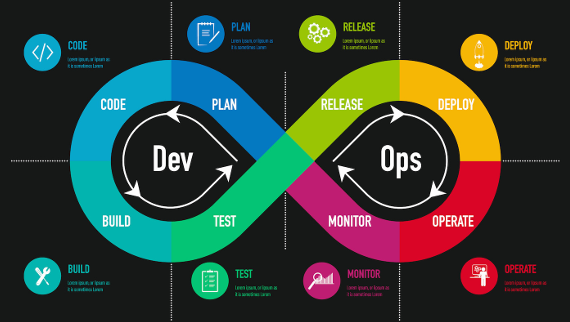

## Tools Used in This Project

- **GitHub** – Source control management  
- **Python UnitTest** – Automated testing  
- **Jenkins** – Continuous integration and pipeline automation  
- **Docker** – Containerization  
- **Docker Hub** – Docker image repository  
- **Ansible** – Configuration management and deployment  

---

## 3. Jenkins Pipeline

The `Jenkinsfile` defines the CI/CD pipeline for this project. The pipeline stages are as below:

### 3.1 Pipeline Overview
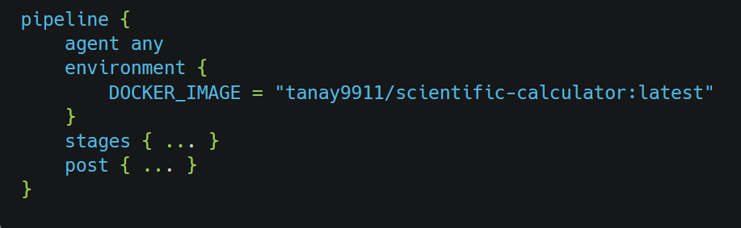
- **agent any:** Runs the pipeline on any available Jenkins agent.  
- **environment:** Defines environment variables, including the Docker image name.

### 3.2 Stage 1: Checkout
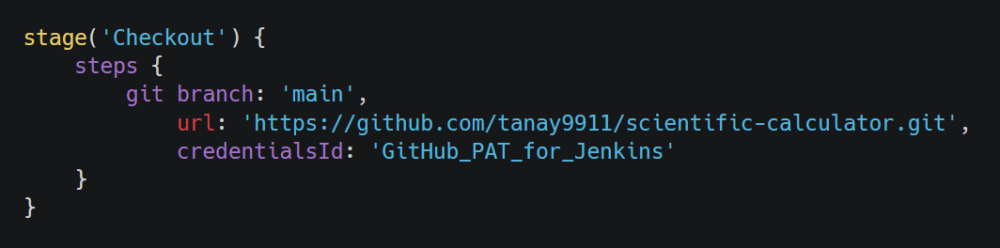
- Pulls the latest code from GitHub.  
- Requires a GitHub Personal Access Token for authentication.

### 3.3 Stage 2: Build / Install Dependencies
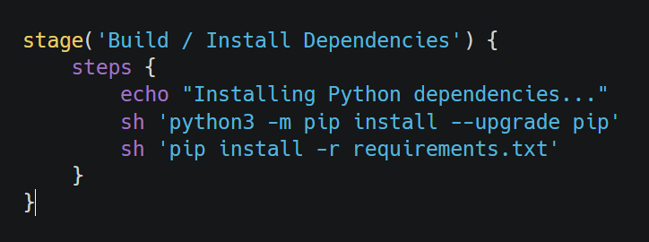
- Updates pip and installs project dependencies from `requirements.txt`.  
- Ensures all libraries, including Flask and pytest, are available.
### 3.4 Stage 3: Run Tests
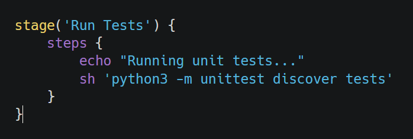
- Runs unit tests defined in `tests/test_calc.py`.  
- Validates all calculator functions (√x, !x, ln(x), x^b).
### 3.5 Stage 4: Docker Build
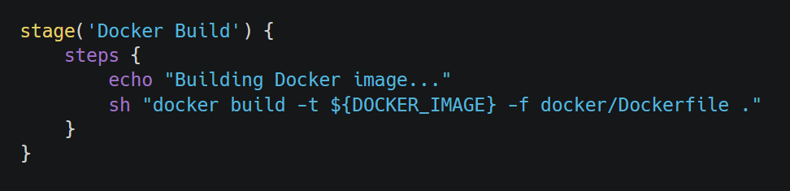
- Builds Docker image using the `docker/Dockerfile`.  
- Sets Python 3.8-slim as base image and copies app and templates.  
- Exposes Flask port 5000.
### 3.6 Stage 5: Docker Push
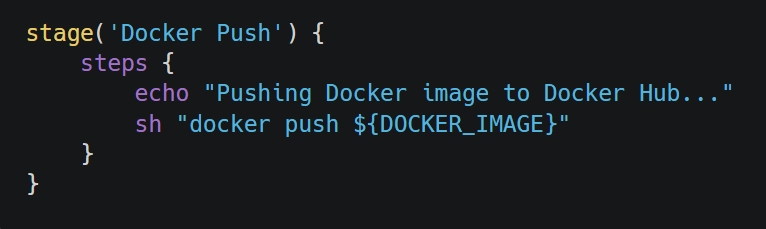
- Pushes the Docker image to Docker Hub under `tanay9911/scientific-calculator`.
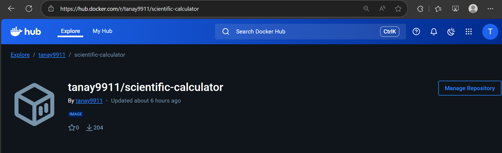
### 3.7 Stage 6: Deploy via Ansible
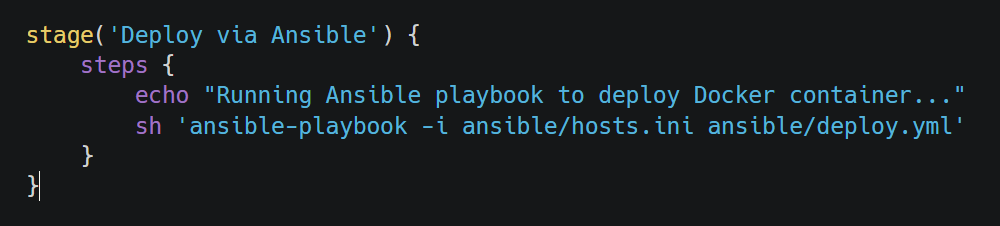
- Uses Ansible to pull Docker image and run container on local machine.  
- Removes existing container if present and ensures container restarts automatically.
### 3.8 Post Actions
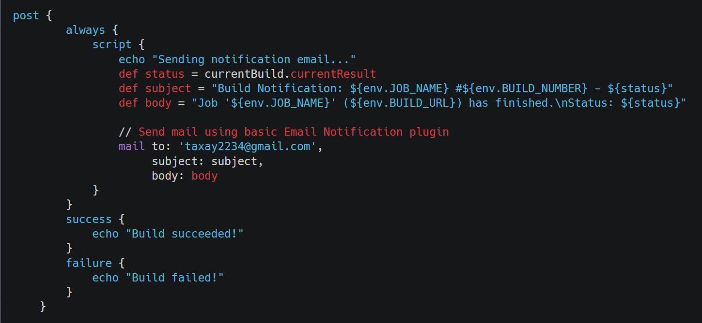
- **Always:** Sends email notification about build status.  
- **Success:** Logs build success.  
- **Failure:** Logs build failure.  
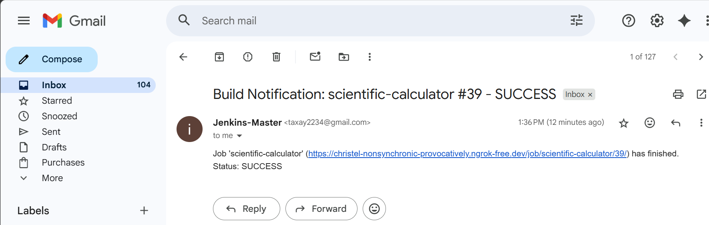
I created some errors myself to test for failure notification.  
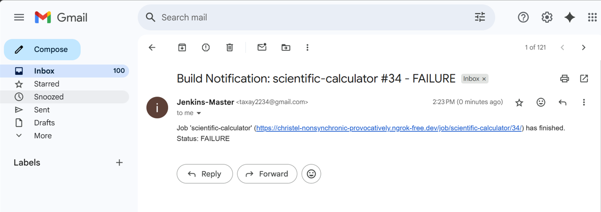
---
### Full jenkins pipeline: 
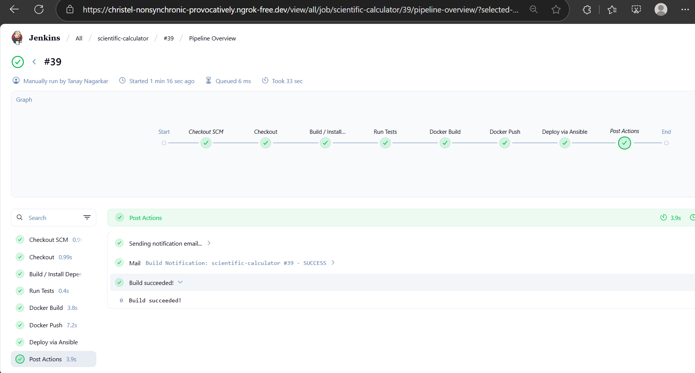
## 4. Dockerfile

- **Base image:** Python 3.8 slim  
- **Workdir:** `/app`  
- **Dependencies:** Installed from `requirements.txt`  
- **Application copy:** `app` and `templates` folders  
- **Port:** 5000 exposed for Flask app  
- **Command:** Runs Flask application  
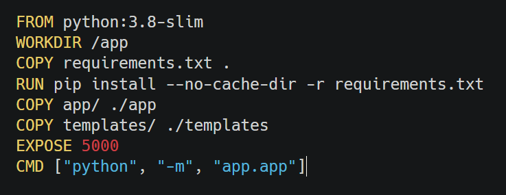
---

## 5. Ansible Playbook
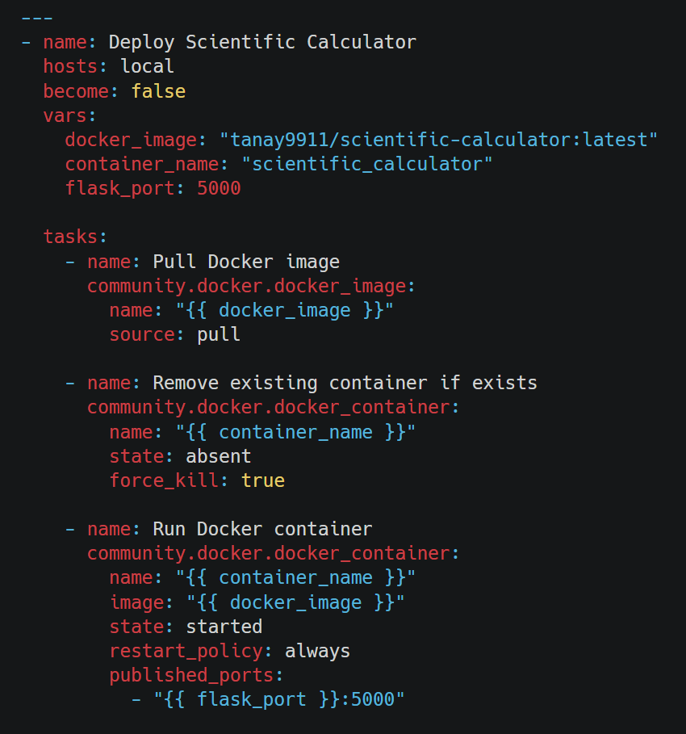
**deploy.yml**  
- Pulls Docker image from Docker Hub  
- Removes previous container if exists  
- Starts container on port 5000  
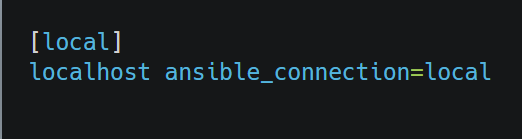
**hosts.ini**  
- Configures Ansible to run tasks locally on the same machine  

---

## 6. Web Application
The web application runs on:  
**http://localhost:5000**
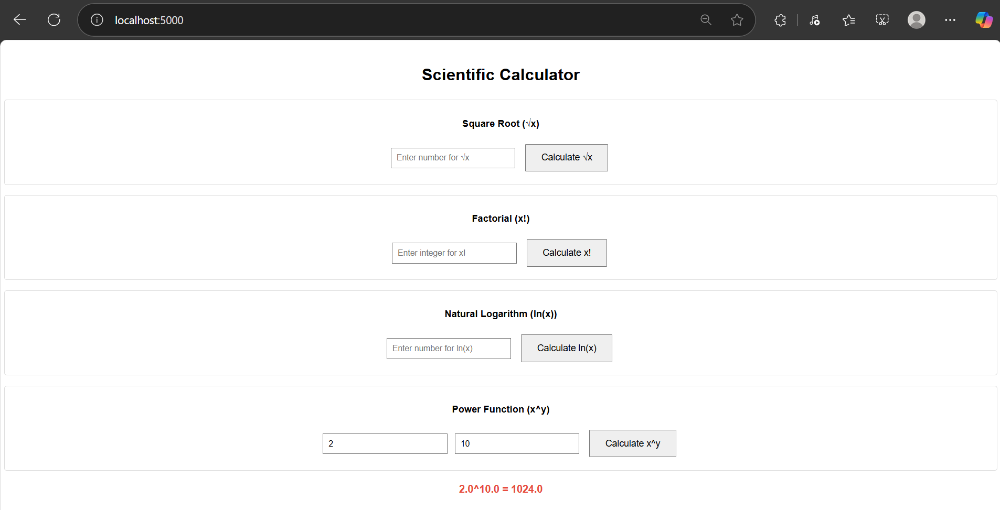
---

## 7. Links
- **GitHub Repository:** [https://github.com/tanay9911/scientific-calculator](https://github.com/tanay9911/scientific-calculator)  
- **Docker Hub:** [https://hub.docker.com/r/tanay9911/scientific-calculator](https://hub.docker.com/r/tanay9911/scientific-calculator)

---

## 8. Conclusion
This mini project demonstrates:

- Development of a scientific calculator in Python  
- Integration of DevOps pipeline for CI/CD using Jenkins  
- Automated testing with unittest  
- Docker containerization and deployment using Ansible  
- Full cycle from code commit to automated deployment  

---

